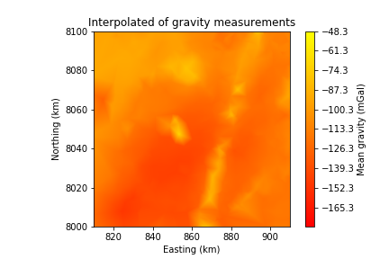
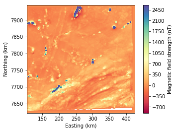

# Potential_Field_Analysis
Potential field analysis of the gravity and magnetic fields in Scotland and Zimbabwe. Processing involved interpolation of the discrete data onto a regular grid, fourier transform and filtering including spatial gradients, upward continutation and pie-crust filtering. This workflow was applied to both gravity data and aeromagnetic data.

Examples of the analysis results:

