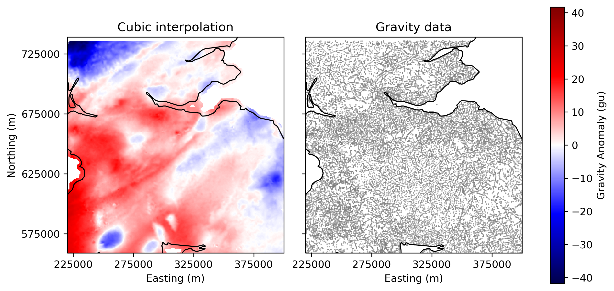
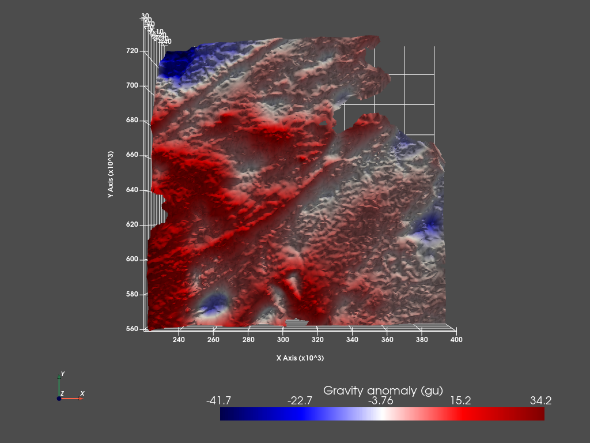
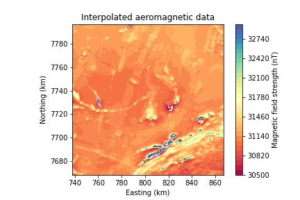

# Potential_Field_Analysis
Potential field analysis of the gravity and magnetic fields in Scotland and Zimbabwe. Processing involved interpolation of the discrete data onto a regular grid, fourier transform and filtering including spatial gradients, upward continutation and pie-crust filtering. This workflow was applied to both gravity data and aeromagnetic data.

### Installation
***
These notebooks can be run on your own computer. I recommend using conda to do so. First, clone this repository. These can be run using the following commands in a terminal pointed at your local copy of this repostiory with conda installed:

    $ conda env create -f environment.yml
    $ conda activate pyvista

### Examples
***
- Cubic interpolated gravity anomaly potential field for the Central Belt of Scotland showing the stations from which the data have been gridded.

- And a 3D plot in PyVista!

- Gridded aeromagnetic data from Zimbabwe

